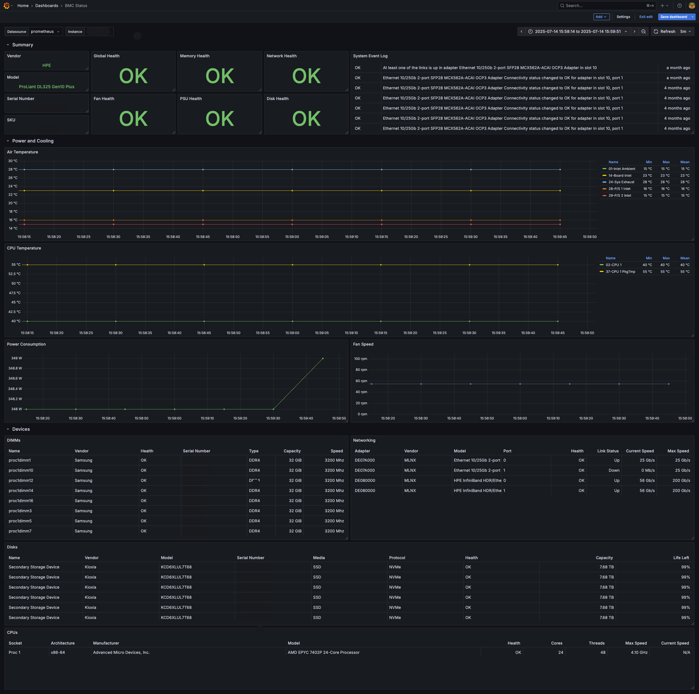

# iDRAC Exporter
This is a simple Redfish (iDRAC, iLO, XClarity) exporter for [Prometheus](https://prometheus.io). The exporter uses the Redfish API to collect information and it supports the regular `/metrics` endpoint to expose metrics from the host passed via the `target` parameter. For example, to scrape metrics from a Redfish instance on the IP address `192.168.1.1` call the following URL address.

```text
http://localhost:9348/metrics?target=192.168.1.1
```

Every time the exporter is called with a new target, it tries to establish a connection to the Redfish API. If the target is unreachable or if the authentication fails, the status code 500 is returned together with an error message.


## Supported Systems
The program supports several different systems, because they all follow the Redfish standard. The exporter has been tested on the following systems.

* HPE iLO
* Dell iDRAC
* Lenovo XClarity


## Installation
The exporter is written in [Go](https://golang.org) and it can be downloaded and compiled using:

```sh
git clone https://github.com/mrlhansen/idrac_exporter.git
cd idrac_exporter
make
```

### Docker
> [!IMPORTANT]
> Starting with v2.3.0 the container images are released on GHCR instead of Docker Hub. For those using Helm, the images are automatically pulled from the new repository. However, users running the container manually will have to switch to the new repository.

There is a `Dockerfile` in the repository for building a container image. To build it locally use:

```sh
docker build -t idrac_exporter .
```

There are also pre-built images available. To download these images, simply use the following command.

```sh
docker pull ghcr.io/mrlhansen/idrac_exporter
```

Remember to set the listen address to `0.0.0.0` when running inside a container.

### Helm Chart
There is also an official [Helm](https://helm.sh/docs/) chart for installing the exporter in a Kubernetes cluster.

```sh
helm repo add idrac-exporter https://mrlhansen.github.io/idrac_exporter
helm install idrac-exporter idrac-exporter/idrac-exporter
```


## Configuration
There are many [configuration options](sample-config.yml) for the exporter, but most importantly you need to provide a username and password for all remote hosts, and you can select which metrics should be exported. By default, the exporter looks for the configuration file in `/etc/prometheus/idrac.yml` but the path can be specified using the `-config` option.

```yaml
address: 127.0.0.1 # Listen address
port: 9348         # Listen port
timeout: 10        # HTTP timeout (in seconds) for Redfish API calls
hosts:
  default:
    username: user
    password: pass
  192.168.1.1:
    username: user
    password: pass
metrics:
  all: true
```

As shown in the above example, under `hosts` you can specify login information for individual hosts via their IP address or hostname, otherwise the exporter will attempt to use the login information under `default`. The login user only needs read-only permissions. Under `metrics` you can select what kind of metrics that should be returned.

**For a detailed description of the configuration, please see the [sample-config.yml](sample-config.yml) file. In this file you can also find the corresponding environment variables for the different configuration options.**

Because the metrics are collected on-demand it can take several minutes to scrape the metrics endpoint, depending on how many metrics groups are selected in the configuration file. For this reason, you should carefully select the metrics of interest and make sure Prometheus is configured with a sufficiently high scrape timeout value.


## List of Metrics
The exporter can expose the metrics described in the sections below. For each metric you can see the name and the associated labels. For all `<name>_health` metrics the value has the following mapping.

* 0 = OK
* 1 = Warning
* 2 = Critical

### System
These metrics include power, health, and LED state, total memory size, number of physical processors, BIOS version and machine information.

```c
idrac_system_power_on
idrac_system_health{status}
idrac_system_indicator_led_on{state} // deprecated, new metric below
idrac_system_indicator_active
idrac_system_memory_size_bytes
idrac_system_cpu_count{model}
idrac_system_bios_info{version}
idrac_system_machine_info{manufacturer,model,serial,sku}
```

### Sensors
These metrics include temperature and FAN health and speeds.

```text
idrac_sensors_temperature{id,name,units}
idrac_sensors_fan_health{id,name,status}
idrac_sensors_fan_speed{id,name,units}
```

### Power
These metrics include two sets of power readings. The first set is PSU power readings, such as power usage, total power capacity, input voltage and efficiency.

```text
idrac_power_supply_health{id,status}
idrac_power_supply_output_watts{id}
idrac_power_supply_input_watts{id}
idrac_power_supply_capacity_watts{id}
idrac_power_supply_input_voltage{id}
idrac_power_supply_efficiency_percent{id}
```

The second set is the power consumption for the entire system (and sometimes also for certain subsystems, such as the CPUs). The first two metrics are instantaneous readings, while the last four metrics are the minimum, maximum and average power consumption as measure over the reported interval.

```text
idrac_power_control_consumed_watts{id,name}
idrac_power_control_capacity_watts{id,name}
idrac_power_control_min_consumed_watts{id,name}
idrac_power_control_max_consumed_watts{id,name}
idrac_power_control_avg_consumed_watts{id,name}
idrac_power_control_interval_in_minutes{id,name}
```

### Processors
These metrics include information about the CPUs in the system.

```text
idrac_cpu_info{arch,id,manufacturer,model,socket}
idrac_cpu_health{id,status}
idrac_cpu_voltage{id}
idrac_cpu_max_speed_mhz{id}
idrac_cpu_current_speed_mhz{id}
idrac_cpu_total_cores{id}
idrac_cpu_total_threads{id}
```

### System Event Log
This is not exactly an ordinary metric, but it is often convenient to be informed about new entries in the event log. The value of this metric is the Unix timestamp for when the entry was created.

```text
idrac_events_log_entry{id,message,severity}
```

### Storage
The storage metrics are divided into four different groups.

* The first group defines a storage subgroup inside Redfish. All other storage metrics are children of this subgroup.
* The second group is information about physical drives.
* The third group is information about storage controllers.
* The fourth group is information about virtual volumes, such as RAIDs.

There is one last metric for Dell systems, which reports the health status of an associated RAID controller battery (when present).

```text
idrac_storage_info{id,name}
idrac_storage_health{id,status}

idrac_storage_drive_info{id,manufacturer,mediatype,model,name,protocol,serial,slot,storage_id}
idrac_storage_drive_health{id,status,storage_id}
idrac_storage_drive_capacity_bytes{id,storage_id}
idrac_storage_drive_life_left_percent{id,storage_id}
idrac_storage_drive_indicator_active{id,storage_id}

idrac_storage_controller_info{firmware,id,manufacturer,model,name,storage_id}
idrac_storage_controller_health{id,status,storage_id}
idrac_storage_controller_speed_mbps{id,storage_id}

idrac_storage_volume_info{id,name,raidtype,storage_id,volumetype}
idrac_storage_volume_health{id,status,storage_id}
idrac_storage_volume_capacity_bytes{id,storage_id}
idrac_storage_volume_media_span_count{id,storage_id}

idrac_dell_controller_battery_health{id,name,status,storage_id}
```

### Memory
These metrics include information about memory modules in the machine.

```text
idrac_memory_module_info{ecc,id,manufacturer,name,rank,serial,type}
idrac_memory_module_health{id,status}
idrac_memory_module_capacity_bytes{id}
idrac_memory_module_speed_mhz{id}
```

### Network
These metrics include information about network adapters and network ports.

```text
idrac_network_adapter_info{id,manufacturer,model,serial}
idrac_network_adapter_health{id,status}
idrac_network_port_health{adapter_id,id,status}
idrac_network_port_max_speed_mbps{adapter_id,id}
idrac_network_port_current_speed_mbps{adapter_id,id}
idrac_network_port_link_up{adapter_id,id,status}
```

### Extra
These metrics do not belong anywhere else and they might be OEM specific. At the moment only two Dell specific metrics are exported.

```text
idrac_dell_battery_rollup_health{status}
idrac_dell_estimated_system_airflow_cfm
```

### Exporter
These metrics contain information about the exporter itself, such as build information and how many errors that have been encountered when scraping the Redfish API.

```text
idrac_exporter_build_info{goversion,revision,version}
idrac_exporter_scrape_errors_total
```


## Endpoints
The exporter currently has three different endpoints.

| Endpoint     | Parameters | Description                                         |
| ------------ | ---------- | --------------------------------------------------- |
| `/metrics`   | `target`   | Metrics for the specified target                    |
| `/reset`     | `target`   | Reset internal state for the specified target       |
| `/discover`  |            | Endpoint for Prometheus Service Discovery           |
| `/health`    |            | Returns http status 200 and nothing else            |


## Prometheus Configuration
For the situation where you have a single `idrac_exporter` and multiple hosts to query, the following `prometheus.yml` snippet can be used. Here `192.168.1.1` and `192.168.1.2` are the hosts to query, and `exporter:9348` is the address and port where `idrac_exporter` is running.

```yaml
scrape_configs:
  - job_name: idrac
    static_configs:
      - targets: ['192.168.1.1', '192.168.1.2']
    relabel_configs:
      - source_labels: [__address__]
        target_label: __param_target
      - source_labels: [__param_target]
        target_label: instance
      - target_label: __address__
        replacement: exporter:9348
```

You can also use the service discovery mechanism in Prometheus to automatically discover all the targets configured in the configuration file for the exporter. The configuration is quite similar, but instead of static targets we query the discovery endpoint.

```yaml
scrape_configs:
  - job_name: idrac
    http_sd_configs:
      - url: http://exporter:9348/discover
    relabel_configs:
      - source_labels: [__address__]
        target_label: __param_target
      - source_labels: [__param_target]
        target_label: instance
      - source_labels: [__meta_url]
        target_label: __address__
        regex: (https?.{3})([^\/]+)(.+)
        replacement: $2
```


## Grafana Dashboard
There are some different Grafana Dashboards in the `grafana` folder.

Example of [grafana/idrac.json](grafana/idrac.json) which shows detailed information about individual machines. Made by [@7840vz](https://www.github.com/7840vz).


Example of [grafana/idrac_overview.json](grafana/idrac_overview.json) which shows a global overview of all machines. Made by [@7840vz](https://www.github.com/7840vz).


Example of [grafana/status-alternative.json](grafana/status-alternative.json) which shows detailed information for individual machines.


