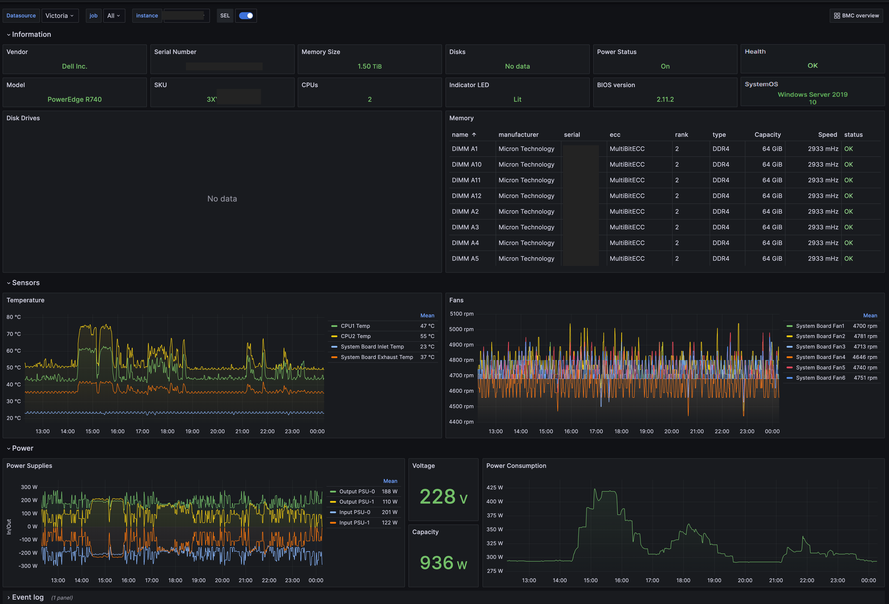

# iDRAC Exporter
This is a simple Redfish (iDRAC, iLO, XClarity) exporter for [Prometheus](https://prometheus.io). The exporter uses the Redfish API to collect information and it supports the regular `/metrics` endpoint to expose metrics from the host passed via the `target` parameter. For example, to scrape metrics from a Redfish instance on the IP address `123.45.6.78` call the following URL address.

```text
http://localhost:9348/metrics?target=123.45.6.78
```

Every time the exporter is called with a new target, it tries to establish a connection to the Redfish API. If the target is unreachable or if the authentication fails, the status code 500 is returned together with an error message.

## Supported Systems
The program supports several different systems, because they all follow the Redfish standard. The exporter has been tested on the following systems.

* HPE iLO
* Dell iDRAC
* Lenovo XClarity

## Installation
The exporter is written in [Go](https://golang.org) and it can be downloaded and compiled using:

```sh
go install github.com/mrlhansen/idrac_exporter/cmd/idrac_exporter@latest
```

### Docker
There is a `Dockerfile` in the repository for building a container image. To build it locally use:

```sh
docker build -t idrac_exporter .
```

There are also pre-built images available on [Docker Hub](https://hub.docker.com/r/mrlhansen/idrac_exporter). To download and run these images, simply use the following command.

```sh
docker run -v /host-path/config.yml:/etc/prometheus/idrac.yml -p 9348:9348 mrlhansen/idrac_exporter
```

Remember to set the listen address to `0.0.0.0` when running inside a container.

### Helm Chart
There is also an official [Helm](https://helm.sh/docs/) chart for installing the exporter in a Kubernetes cluster.

```sh
helm repo add idrac-exporter https://mrlhansen.github.io/idrac_exporter
helm install idrac-exporter idrac-exporter/idrac-exporter
```

## Configuration
In the configuration file for the exporter you can specify the bind address and port for the metrics exporter, as well as username and password for all remote hosts. By default, the exporter looks for the configuration file in `/etc/prometheus/idrac.yml` but the path can be specified using the `-config` option.

```yaml
address: 127.0.0.1 # Listen address
port: 9348         # Listen port
timeout: 10        # HTTP timeout (in seconds) for Redfish API calls
hosts:
  123.45.6.78:
    username: user
    password: pass
  default:
    username: user
    password: pass
metrics:
  system: true
  sensors: true
  power: true
  events: false
  storage: false
  memory: false
  network: false
```

As shown in the above example, under `hosts` you can specify login information for individual hosts via their IP address, otherwise the exporter will attempt to use the login information under `default`. The login user only needs read-only permissions. Under `metrics` you can select what kind of metrics that should be returned, as described in more detail below.

**For a detailed description of the configuration, please see the [sample-config.yml](sample-config.yml) file. In this file you can also find the corresponding environment variables for the different configuration options.**

Because the metrics are collected on-demand it can take several minutes to scrape the metrics endpoint, depending on how many metrics groups are selected in the configuration file. For this reason, you should carefully select the metrics of interest and make sure Prometheus is configured with a sufficiently high scrape timeout value.

## List of Metrics
The exporter can expose the metrics listed in the sections below. For all `<name>_health` metrics the value has the following mapping.
* 0 = OK
* 1 = Warning
* 2 = Critical

### System
These metrics include power, health, and LED state, total memory size, number of physical processors, BIOS version and machine information.

```c
idrac_system_power_on 1
idrac_system_health{status="OK"} 0
idrac_system_indicator_led_on{state="Lit"} 1 // deprecated, new metric below
idrac_system_indicator_active 1
idrac_system_memory_size_bytes 137438953472
idrac_system_cpu_count{model="Intel(R) Xeon(R) Gold 6130 CPU @ 2.10GHz"} 2
idrac_system_bios_info{version="2.3.10"} 1
idrac_system_machine_info{manufacturer="Dell Inc.",model="PowerEdge C6420",serial="abc",sku="xyz"} 1
```

### Sensors
These metrics include temperature and FAN health and speeds.

```c
idrac_sensors_temperature{id="0",name="Inlet Temp",units="celsius"} 19
idrac_sensors_fan_health{id="0",name="FAN1A",status="OK"} 0
idrac_sensors_fan_speed{id="0",name="FAN1A",units="rpm"} 7912
```

### Power
These metrics include two sets of power readings. The first set is PSU power readings, such as power usage, total power capacity, input voltage and efficiency. Be aware that not all metrics are available on all systems.

```c
idrac_power_supply_health{id="0",status="OK"} 0
idrac_power_supply_output_watts{id="0"} 74.5
idrac_power_supply_input_watts{id="0"} 89
idrac_power_supply_capacity_watts{id="0"} 750
idrac_power_supply_input_voltage{id="0"} 232
idrac_power_supply_efficiency_percent{id="0"} 91
```

The second set is the power consumption for the entire system (and sometimes also for certain subsystems, such as the CPUs). The first two metrics are instantaneous readings, while the last four metrics are the minimum, maximum and average power consumption as measure over the reported interval.

```c
idrac_power_control_consumed_watts{id="0",name="System Power Control"} 166
idrac_power_control_capacity_watts{id="0",name="System Power Control"} 816
idrac_power_control_min_consumed_watts{id="0",name="System Power Control"} 165
idrac_power_control_max_consumed_watts{id="0",name="System Power Control"} 177
idrac_power_control_avg_consumed_watts{id="0",name="System Power Control"} 166
idrac_power_control_interval_in_minutes{id="0",name="System Power Control"} 1
```

### Processors
These metrics include information about the CPUs in the system.

```c
idrac_cpu_health{id="CPU.Socket.1",status="OK"} 0
idrac_cpu_info{arch="x86-64",id="CPU.Socket.1",manufacturer="Intel",model="Intel(R) Xeon(R) Silver 4108 CPU @ 1.80GHz",socket="CPU.Socket.1"} 1
idrac_cpu_max_speed_mhz{id="CPU.Socket.1"} 4000
idrac_cpu_operating_speed_mhz{id="CPU.Socket.1"} 1800
idrac_cpu_total_cores{id="CPU.Socket.1"} 8
idrac_cpu_total_threads{id="CPU.Socket.1"} 16
```

### System Event Log
This is not exactly an ordinary metric, but it is often convenient to be informed about new entries in the event log. The value of this metric is the Unix timestamp for when the entry was created.

```c
idrac_events_log_entry{id="1",message="The process of installing an operating system or hypervisor is successfully completed",severity="OK"} 1631175352
```

### Storage
These metrics include information about disk drives in the machine.

```c
idrac_drive_info{controller_id="AHCI.Slot.5-1",id="Disk.Direct.1-1:AHCI.Slot.5-1",manufacturer="MICRON",mediatype="SSD",model="MTFDDAV240TDU",name="SSD 1",protocol="SATA",serial="xyz",slot="1"} 1
idrac_drive_health{controller_id="AHCI.Slot.5-1",id="Disk.Direct.1-1:AHCI.Slot.5-1",status="OK"} 0
idrac_drive_capacity_bytes{controller_id="AHCI.Slot.5-1",id="Disk.Direct.1-1:AHCI.Slot.5-1"} 240057409536
idrac_drive_life_left_percent{controller_id="AHCI.Slot.5-1",id="Disk.Direct.1-1:AHCI.Slot.5-1"} 100
```

### Memory
These metrics include information about memory modules in the machine.

```c
idrac_memory_module_info{ecc="MultiBitECC",id="DIMM.Socket.A2",manufacturer="Micron Technology",name="DIMM A2",rank="2",serial="xyz",type="DDR4"} 1
idrac_memory_module_health{id="DIMM.Socket.A2",status="OK"} 0
idrac_memory_module_capacity_bytes{id="DIMM.Socket.A2"} 34359738368
idrac_memory_module_speed_mhz{id="DIMM.Socket.A2"} 2400
```

### Network
These metrics include health of network interfaces, as well as health, link speed, and link status for each of the network ports.

```c
idrac_network_interface_health{id="NIC.Embedded.1",status="OK"} 0
idrac_network_port_health{id="NIC.Embedded.1-1",interface_id="NIC.Embedded.1",status="OK"} 0
idrac_network_port_link_up{id="NIC.Embedded.1-1",interface_id="NIC.Embedded.1",status="Up"} 1
idrac_network_port_speed_mbps{id="NIC.Embedded.1-1",interface_id="NIC.Embedded.1"} 1000
```

### OEM
These metrics are OEM specific and thus only available on the supported systems. At the moment only two Dell specific metrics are exported.

```c
idrac_dell_battery_rollup_health{status="OK"} 0
idrac_dell_estimated_system_airflow_cfm 47
```

### Exporter
These metrics contain information about the exporter itself, such as build information and how many errors that have been encountered when scraping the Redfish API.

```c
idrac_exporter_build_info{goversion="go1.21.1",revision="xyz",version="1.0.0"} 1
idrac_exporter_scrape_errors_total 0
```

## Endpoints
The exporter currently has three different endpoints.

| Endpoint   | Parameters | Description                                         |
| ---------- | ---------- | --------------------------------------------------- |
| `/metrics` | `target`   | Metrics for the specified target                    |
| `/reset`   | `target`   | Reset internal state for the specified target       |
| `/health`  |            | Returns http status 200 and nothing else            |

## Prometheus Configuration
For the situation where you have a single `idrac_exporter` and multiple hosts to query, the following `prometheus.yml` snippet can be used.

```yaml
scrape_configs:
  - job_name: idrac
    static_configs:
      - targets: ['123.45.6.78', '123.45.6.79']
    relabel_configs:
      - source_labels: [__address__]
        target_label: __param_target
      - source_labels: [__param_target]
        target_label: instance
      - target_label: __address__
        replacement: exporter:9348
```

Here `123.45.6.78` and `123.45.6.79` are the hosts to query, and `exporter:9348` is the address and port where `idrac_exporter` is running.

## Grafana Dashboard
There are two Grafana Dashboards in the `grafana` folder, one that shows an overview of all systems and one that shows information for a specific machine. Thanks to [@7840vz](https://www.github.com/7840vz)  for creating these!




